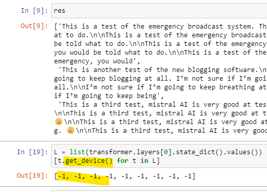

# Mistral Transformer

This repository contains modified code for running mistral's 7B model on CPU.

See the original repo for details: https://github.com/mistralai/mistral-src

Only the implemenatation in `one_file_ref.py` has been updated for this exercise. 
It works, for CPU, modulo some changes made to tidy it up...

